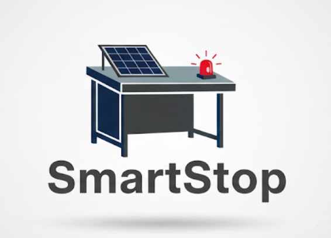

<div align="center">



# SmartStop
### *"A smarter stop starts here"*

</div>

---

##  Overview

**SmartStop** is an inclusive, solar-powered smart bus shelter designed to transform the public transport waiting experience for all passengers — with a particular focus on accessibility, real-time passenger information, safety, and sustainability.

> Buses account for nearly **70% of all public transport trips**, with passengers typically waiting **10–20 minutes** at each stop. Traditional bus stops offer only basic shelter and seating, with limited features and little support for elderly or disabled users. SmartStop solves this.

---

##  Poster

<div align="center">

</div>

---

##  Key Features

| Feature | Description |
|:---|:---|
| **Solar Panels** | Three rooftop solar panels provide clean, renewable energy to power all electronic components, reducing operating costs and supporting sustainability goals |
| **Real-Time Information Display** | Large touchscreen showing live bus arrival times, interactive route maps, QR codes for further information, and advertising panels |
| **Wheelchair Accessible Space** | Dedicated, clearly marked zone ensuring comfortable and dignified boarding for users with mobility needs |
| **Dimmable & Programmable LED Lighting** | Smart lighting system that improves visibility at night, adjusts brightness automatically to save energy, and reduces light pollution |
| **Passenger Call Button** | Allows passengers to request help, hail the bus, or activate audio notifications — improving inclusivity for visually or hearing-impaired users |
| **Visual & Audible Information** | On-screen and audio announcements keep all passengers informed of arrivals, delays, and route changes at all times |
| **CCTV** | Motorised security camera deters antisocial behaviour and enhances passenger safety, especially at night |
| **Mobile App Integration** | Arduino communicates with a companion mobile app to extend information access beyond the stop itself |

---

##  Physical Prototype

The prototype was hand-built using aluminium composite panels, with all electronic components integrated and functional.

<div align="center">

### Full Prototype — Annotated Components


---

### Real-Time Information Display


*The display shows live bus arrival times at the top and rotates through advertising and information content below, funded by local businesses to offset operating costs.*

---

### LCD Screen & LED Lighting


*The interior LCD displays passenger status messages while the dimmable LED strip illuminates the shelter at night.*

---

### Wheelchair Accessible Space


*A clearly designated wheelchair bay with tactile flooring markings ensures users with mobility needs have a safe, reserved space close to the bus boarding point.*

---

### CCTV Module — Internal View


*The HuskyLens AI camera module is mounted on a motorised pan mechanism, controlled by a dedicated Arduino, to provide full coverage of the shelter interior.*

</div>

---

## Demo Video

<div align="center">

https://github.com/user-attachments/assets/3B9_Universal_Design_Innovation_Project_-_Group_6_-_2025_720p.mp4

</div>

---

##  CAD Design

Fully modelled in **SolidWorks** with precise dimensions, photorealistic renders, and multiple assembly views.

<div align="center">

### Isometric View with Bus


---

### Interior View — All Features Visible


---

### Aerial Rear View — Solar Panel Layout


---

### Front View — Information Display


---

### Interior Detail Views


</div>

---

##  Hardware & Electronics

### Schematic

<div align="center">

</div>

### System Architecture

The electronics system is built around **two Arduino UNO microcontrollers** working in parallel:

| Subsystem | Component | Responsibilities |
|:---|:---|:---|
| Arduino #1 | Microcontroller | DC Motor control, CCTV camera rotation |
| Arduino #2 | Microcontroller | LCD Display, LED strip control, Call button, HuskyLens comms, Mobile app bridge |
| Power System | Solar Panel | Charges LiPo battery via LiPo charger |
| Power System | LiPo Battery | Energy storage for LED components |
| Power System | Battery Pack | Powers all main components |

### Components

| Component | Quantity | Purpose |
|:---|:---:|:---|
| Arduino UNO | 2 | Main microcontrollers |
| HuskyLens AI Camera | 1 | CCTV / security camera |
| DC Motor + H-Bridge | 1 | Motorised camera rotation |
| 16×2 LCD Display | 1 | Passenger status messages |
| LED Strip | 1 | Dimmable shelter lighting |
| Push Button + LED | 1 | Passenger call button |
| Solar Panel | 1 | Renewable power source |
| LiPo Battery (110mAh 3.7V) | 1 | Energy storage for LEDs |
| LiPo USB Charger (SparkFun) | 1 | Solar charging circuit |
| Battery Pack | 1 | Power for all main components |
| Breadboard | 2 | Prototyping and connections |

### Wire Legend

| Colour | Connection |
|:---|:---|
| Black | Ground |
| Red | Power |
| Blue | LCD to Arduino |
| Green | LED to Arduino |
| Purple | Button to Arduino |
| Orange (banded) | H-Bridge/Motor to Arduino |
| Yellow | HuskyLens to Arduino |

---

##  Repository Structure

```
SmartStop/

 1_Logo/
    Logo.png                        ← Project branding

 2_Poster/
    Poster.png                      ← Official competition poster

 3_CAD/
    Stop View.PNG                   ← Interior isometric view
    Diagonal View.PNG               ← Diagonal view with bus
    Diagonal View 2.PNG             ← Alternative diagonal
    Front View.PNG                  ← Information display front
    Aerial Back view.PNG            ← Aerial solar panel view
    Side Inside view.PNG            ← Interior side view
    Side Inside view lights.PNG     ← Interior with lights on

 4_Photos/
    Photo 1.png                     ← Annotated full prototype
    Photo 2.png                     ← Information display screen
    Photo 3.png                     ← LCD and LED lighting
    Photo 4.png                     ← Wheelchair accessible space
    Photo 5.png                     ← CCTV module internals

 5_Hardware_Schematic/
    Hardware Schematic.png          ← Full Fritzing schematic

 6_Code/
    Code.pdf                        ← Arduino source code

 7_Video/
    Video.pdf                       ← Demonstration video

 8_Presentation/
     Presentation.pdf                ← Project presentation slides
```

---

##  Tech Stack

- **CAD Modelling:** SolidWorks
- **Schematic Design:** Fritzing
- **Microcontroller:** Arduino UNO (C++)
- **Computer Vision:** HuskyLens AI Camera
- **Power System:** Solar + LiPo battery
- **Fabrication:** Aluminium composite panels, 3D-printed components

---

##  Submission

This project was submitted to the **Smarter Travel Student Awards**, organised by Transport for Ireland (TFI), as part of the Trinity College Dublin 3B9 Engineering Design module, November 2025.

---

##  Team — Group 06

| Name |
|:---|
| Helen Reynolds |
| Guru Chappelle |
| Luke Thomas |
| Christos Papalysandrou |
| Zacarias Fidalgo Jacinto Nesti |
| Daragh Murray |

*Trinity College Dublin — The University of Dublin*

---

<div align="center">


**SmartStop** — *A smarter stop starts here*

</div>
